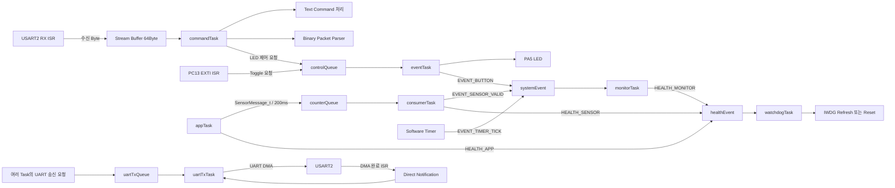
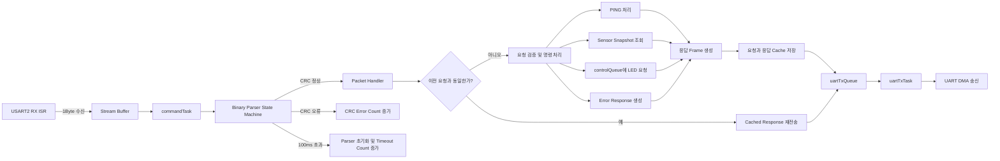
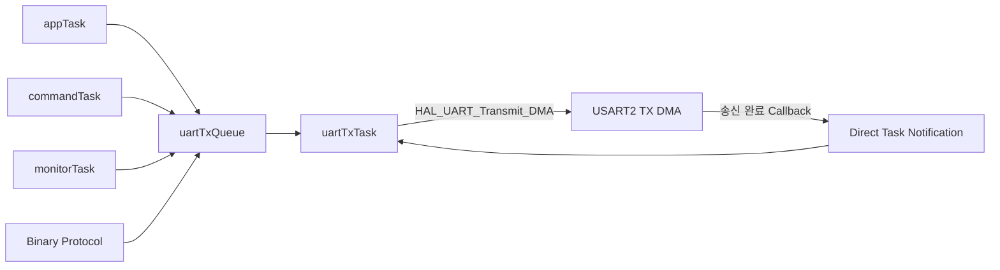

# STM32 FreeRTOS Sensor Controller

STM32F401RE에서 센서 데이터 수집, 장치 제어, UART 통신을  
FreeRTOS Task로 분리하고, 통신 오류와 Task 이상이 발생해도  
검출·복구할 수 있도록 구현한 개인 펌웨어 프로젝트입니다.

단순한 센서 동작 확인을 넘어 UART Binary Protocol의 CRC-16,  
Parser Timeout, Retry, 중복 요청 방지와 Task Health Monitoring,  
IWDG 기반 자동 복구 구조를 구현하고 반복 테스트로 안정성을 검증했습니다.

## 주요 결과

- UART Binary Protocol 자동 테스트 11개 구현
- 11개 테스트를 10회 반복하여 총 110/110 통과
- 정상 Packet 140개 처리 중 중복 요청 20개 감지 및 응답 재전송
- CRC 오류 10회와 Parser Timeout 10회 오류 주입 후 정상 복구
- UART RX Drop 0회, TX Queue Failure 0회
- FreeRTOS Free Heap과 Minimum Free Heap 5,464Byte 유지
- HC-SR04 ECHO 단선 시 Sensor Invalid 감지 후 재연결 자동 복구
- `appTask` 정지 시 IWDG Reset 발생 및 `RESET CAUSE: IWDG` 확인
- 부팅 시 RTOS 객체, OLED, EEPROM, RTC, 센서 Self-Test 전체 PASS

## 프로젝트 목표

STM32 주변장치 제어 실습에서 출발해, 여러 기능이 동시에 동작하는 환경에서  
데이터 전달, 통신 오류 처리, 자원 관리, 장애 복구까지 경험할 수 있는  
펌웨어 시스템을 구현하는 것을 목표로 했습니다.

현재 기능은 Bare-metal 구조로도 구현할 수 있지만, 센서 처리, 명령 파싱,  
출력 제어, 상태 모니터링, UART DMA 송신의 실행 책임과 Blocking 영향을  
분리하기 위해 FreeRTOS 기반 구조로 확장했습니다.

## 기술 스택

- **Language:** C, Python
- **MCU:** STM32F401RET6 / NUCLEO-F401RE
- **Framework:** STM32 HAL, FreeRTOS, CMSIS-RTOS2
- **Peripheral:** GPIO, UART, I2C, Timer, PWM, Input Capture, DMA, IWDG
- **RTOS:** Queue, Event Flag, Stream Buffer, Direct Task Notification
- **Protocol:** Binary Frame, CRC-16/CCITT-FALSE, Timeout, Retry, Duplicate Cache

## 시스템 요구사항

### 기능적 요구사항

- HC-SR04 거리 데이터를 주기적으로 측정하고 유효성을 판정
- OLED와 UART를 통해 센서 및 시스템 상태 제공
- UART Text Command와 Binary Protocol 동시 지원
- Binary 명령을 통한 상태 조회 및 LED 제어
- RTC, OLED, EEPROM 등 I2C 장치의 부팅 Self-Test
- 버튼 입력, LED, Buzzer, PWM 출력 등 주변장치 제어

### 신뢰성 요구사항

- UART RX ISR에서는 수신 Byte 저장과 다음 수신 등록만 수행
- Stream Buffer를 이용해 ISR과 명령 처리 Task 분리
- UART 송신은 전용 Task만 수행하는 Single Writer 구조 사용
- CRC-16을 이용해 손상된 Binary Packet 거부
- 불완전 Packet은 Parser Timeout 후 폐기하고 정상 상태로 복구
- 응답 유실 시 동일한 Sequence를 사용해 Retry
- 동일 요청 재수신 시 명령을 다시 실행하지 않고 Cached Response 재전송
- 주요 Task의 Health 상태가 모두 확인된 경우에만 IWDG Refresh
- 센서 단선과 Task 이상 발생 후 시스템 자동 복구
- Heap, Stack, RX Drop, TX Queue Failure 측정을 통한 안정성 확인

## 하드웨어 구성

| 부품 | 인터페이스 / 핀 | 용도 |
|---|---|---|
| NUCLEO-F401RE | STM32F401RET6, 84MHz | 메인 제어 보드 |
| HC-SR04 | TRIG: PB5, ECHO: PA6 / TIM3_CH1 | 초음파 거리 측정 |
| SSD1306 OLED | I2C1 PB8/PB9, 주소 0x3C | 센서값과 시스템 상태 표시 |
| DS3231 RTC | I2C1 PB8/PB9, 주소 0x68 | 날짜 및 시간 정보 제공 |
| RTC 모듈 내 EEPROM | I2C1 PB8/PB9, 주소 0x57 | I2C 장치 확인 및 저장 인터페이스 |
| KY-006 부저 | PB6 / TIM4_CH1 | PWM 경고음 출력 |
| SG90 서보모터 | PB10 / TIM2_CH3 | 50Hz PWM 제어 신호 출력 |
| NUCLEO LD2 | PA5 | Text 및 Binary 명령을 통한 LED 제어 |
| 사용자 버튼 | PC13 / EXTI | 외부 인터럽트 입력 |
| UART2 VCP | PA2 TX, PA3 RX | Text 명령, Binary Protocol, 디버그 로그 |
| USB 로직 애널라이저 | UART, I2C, PWM 신호선 | 통신 및 PWM 파형 검증 |

### 배선 및 전기적 고려사항

- 모든 모듈과 NUCLEO 보드의 GND를 공통으로 연결했습니다.
- HC-SR04는 5V 전원을 사용했습니다.
- HC-SR04의 ECHO 신호는 약 5V이므로, 10kΩ과 20kΩ 저항으로 전압 분배 회로를 구성해 약 3.3V로 낮춘 뒤 PA6에 입력했습니다.
- OLED, RTC, EEPROM은 I2C1 버스를 공유하도록 구성했습니다.
- I2C1 통신 속도는 100kHz로 설정했습니다.
- 서보모터 제어 신호는 50Hz PWM으로 구성했습니다.
- 외부 전원으로 서보모터를 구동할 경우 외부 전원 GND와 NUCLEO GND를 공통으로 연결해야 합니다.

## 소프트웨어 아키텍처

센서 처리, 명령 수신, 장치 제어, 상태 모니터링, UART 송신의 책임을  
각 Task로 분리했습니다.

Task 간 데이터 전달은 전역변수에 직접 의존하기보다 Queue, Event Flag,  
Stream Buffer, Direct Task Notification을 사용하도록 구성했습니다.

### 주요 Task 구성

| Task | 우선순위 | 주요 역할 | 사용 RTOS 객체 |
|---|---|---|---|
| `appTask` | Normal | 애플리케이션 주기 실행, 센서 Snapshot 생성 및 전달 | `counterQueue`, `healthEvent` |
| `commandTask` | Normal | UART Text 명령 처리, Binary Packet 파싱, 제어 요청 생성 | `uartRxStreamBuffer`, `controlQueue` |
| `eventTask` | Below Normal | 버튼 및 명령으로 전달된 LED 제어 요청 처리 | `controlQueue`, `systemEvent` |
| `consumerTask` | Below Normal | 센서 메시지 수신 및 센서 유효 상태 반영 | `counterQueue`, `systemEvent`, `healthEvent` |
| `monitorTask` | Low | 주기 이벤트와 버튼 이벤트 확인, 시스템 상태 로그 출력 | `systemEvent`, `healthEvent` |
| `uartTxTask` | Normal | UART TX Queue를 단독 소비하고 DMA 송신 수행 | `uartTxQueue`, Direct Notification |
| `watchdogTask` | Normal | 주요 Task의 Health Bit 확인 후 IWDG 갱신 | `healthEvent` |

### 전체 데이터 흐름



### 설계 원칙

- UART RX ISR에서는 수신 Byte를 Stream Buffer에 저장하고 다음 수신을 등록하는 최소 작업만 수행했습니다.
- 문자열 파싱, Binary Packet 조립, CRC 검사, 로그 출력은 `commandTask`에서 수행합니다.
- 여러 Task가 UART HAL 함수를 직접 호출하지 않도록 `uartTxTask`만 UART DMA를 사용하는 Single Writer 구조를 적용했습니다.
- 센서 데이터는 생산자와 소비자의 실행 시점을 분리하기 위해 `counterQueue`로 전달합니다.
- LED 제어 요청은 명령 처리와 실제 GPIO 제어 책임을 분리하기 위해 `controlQueue`로 전달합니다.
- 상태 변화와 주기 이벤트는 데이터 자체보다 발생 여부가 중요하므로 Event Flag를 사용했습니다.
- UART DMA 완료 신호는 별도 Semaphore 대신 Direct Task Notification으로 전달했습니다.

## UART Binary Protocol

Text 명령과 별도로 길이 기반 Binary Protocol을 구현했습니다.

문자열 종료 문자에 의존하지 않고 `Length` 필드를 기준으로 Payload를 처리하며,  
CRC-16, Parser Timeout, Retry, 중복 요청 방지를 적용해 통신 신뢰성을 높였습니다.

### Packet 구조

| 필드 | 크기 | 설명 |
|---|---:|---|
| SOF1 | 1Byte | 시작 Byte `0xAA` |
| SOF2 | 1Byte | 시작 Byte `0x55` |
| Version | 1Byte | Protocol Version, 현재 `0x01` |
| Type | 1Byte | 요청 또는 응답 종류 |
| Sequence | 1Byte | 요청과 응답을 식별하는 번호 |
| Length | 1Byte | Payload 길이, 최대 32Byte |
| Payload | 0~32Byte | 명령 또는 응답 데이터 |
| CRC Low | 1Byte | CRC 하위 Byte |
| CRC High | 1Byte | CRC 상위 Byte |

```text
AA 55 | VERSION | TYPE | SEQUENCE | LENGTH | PAYLOAD | CRC_LOW CRC_HIGH
```

CRC 계산 대상에는 SOF를 제외한 다음 필드를 포함합니다.

```text
VERSION + TYPE + SEQUENCE + LENGTH + PAYLOAD
```

### CRC 설정

- **알고리즘:** CRC-16/CCITT-FALSE
- **Polynomial:** `0x1021`
- **Initial Value:** `0xFFFF`
- **Final XOR:** `0x0000`
- **Input/Output Reflection:** 사용하지 않음
- **전송 순서:** Low Byte 먼저 전송

SOF는 Parser가 Packet 경계를 탐색하는 용도로 사용하고,  
실제 Packet 내용의 무결성은 Version부터 Payload까지 검증하도록 구분했습니다.

### 요청 Packet

| Type | 값 | 설명 |
|---|---:|---|
| `PING` | `0x01` | 통신 연결 확인 |
| `GET_STATUS` | `0x02` | 센서 상태 조회 |
| `LED_SET` | `0x03` | LED ON/OFF 제어 |

### 응답 Packet

| Type | 값 | 설명 |
|---|---:|---|
| `PONG` | `0x81` | PING 정상 응답 |
| `STATUS` | `0x82` | 거리값과 센서 유효 상태 응답 |
| `ACK` | `0x83` | 제어 명령 접수 성공 |
| `ERROR` | `0xFF` | 요청 형식 또는 처리 오류 |

### Error Code

| Error Code | 값 | 발생 조건 |
|---|---:|---|
| `OK` | `0x00` | 정상 처리 |
| `INVALID_LENGTH` | `0x01` | 요청 Payload 길이가 잘못된 경우 |
| `INVALID_PAYLOAD` | `0x02` | 허용되지 않은 Payload 값 |
| `UNKNOWN_TYPE` | `0x03` | 정의되지 않은 Packet Type |
| `SNAPSHOT_FAILED` | `0x04` | 센서 Snapshot을 읽지 못한 경우 |
| `CONTROL_QUEUE_FULL` | `0x05` | 제어 Queue에 명령을 넣지 못한 경우 |

### Binary Packet 처리 흐름



## 통신 오류 처리

### 1. CRC 오류 검출

수신 완료된 Packet의 CRC를 계산한 뒤 수신 CRC와 비교합니다.

CRC가 일치하지 않으면 다음과 같이 처리합니다.

- Packet Handler를 호출하지 않음
- 명령을 실행하지 않음
- 응답을 전송하지 않음
- CRC Error Count 증가
- Parser를 초기 상태로 복구

손상된 명령이 실제 장치 제어로 이어지지 않도록 검증과 실행 단계를 분리했습니다.

### 2. 불완전 Packet Timeout

SOF 수신 후 Packet이 완성되지 않은 상태가 100ms 이상 지속되면  
부분 Packet을 폐기하고 Parser를 초기 상태로 되돌립니다.

`commandTask`는 Stream Buffer를 최대 20ms 동안 대기하며,  
수신 데이터가 없더라도 `UartProtocol_CheckTimeout()`을 호출해  
Parser Timeout을 검사합니다.

이를 통해 중간에 끊긴 Packet 때문에 다음 정상 Packet까지  
잘못 해석되는 문제를 방지했습니다.

### 3. 응답 유실 시 Retry

Python 테스트 프로그램은 응답이 0.5초 안에 도착하지 않으면  
동일 요청을 최대 3회까지 재전송합니다.

Retry 시에는 새로운 Sequence를 만들지 않고 기존 Sequence를 유지합니다.

```text
첫 번째 요청 : TYPE 0x01 / SEQ 0x50
재전송 요청  : TYPE 0x01 / SEQ 0x50
```

동일한 Sequence를 사용해야 MCU가 같은 논리적 요청의 재전송인지  
판단할 수 있습니다.

### 4. 중복 명령 실행 방지

Retry 요청을 그대로 다시 실행하면 LED 제어와 같은 명령이  
두 번 수행될 수 있습니다.

이를 방지하기 위해 가장 최근의 요청과 응답 Frame을 Cache에 저장합니다.

다음 항목이 모두 같을 때 중복 요청으로 판단합니다.

- Version
- Type
- Sequence
- Length
- Payload

중복 요청이면 Packet Handler의 명령 처리 코드를 다시 실행하지 않고,  
저장된 응답 Frame만 재전송합니다.

```text
첫 번째 요청
→ 명령 실행
→ 응답 생성
→ 요청과 응답 Cache 저장

동일 요청 Retry
→ 중복 요청 감지
→ 명령 재실행하지 않음
→ Cached Response만 재전송
```

Sequence가 같더라도 Payload가 다르면 새로운 요청으로 처리합니다.

### 5. UART 송신 실패 측정

모든 Binary Frame 송신은 공통 Queue 함수를 거치도록 구성했습니다.

`uartTxQueue` 등록에 실패하면 `TX FAIL` 카운터를 증가시켜  
송신 경로의 오류 발생 여부를 확인할 수 있도록 했습니다.

## 통신 진단 통계

PuTTY에서 다음 명령으로 누적 통계를 확인할 수 있습니다.

```text
PKT STAT
```

| 항목 | 의미 |
|---|---|
| `VALID` | CRC 검증을 통과해 Handler까지 전달된 Packet 수 |
| `DUPLICATE` | 중복 요청으로 감지된 Packet 수 |
| `CRC ERROR` | CRC가 일치하지 않은 Packet 수 |
| `TIMEOUT` | 완성되지 못하고 Timeout 처리된 Packet 수 |
| `RX DROP` | Stream Buffer에 저장하지 못한 UART 수신 Byte 수 |
| `TX FAIL` | UART TX Queue 등록 실패 횟수 |

10회 반복 테스트 후 측정 결과는 다음과 같습니다.

```text
VALID 140 | DUPLICATE 20
CRC ERROR 10 | TIMEOUT 10 | RX DROP 0 | TX FAIL 0
```

## 핵심 문제 해결 사례

### 1. ASCII 문자열 전송에서 길이 기반 Binary Protocol로 개선

#### 문제 상황

초기 UART 통신에서는 사람이 읽을 수 있는 문자열 중심으로 명령을 처리했습니다.

하지만 Binary Packet을 구현하면서 다음 두 데이터가 서로 다르다는 점을 확인했습니다.

```text
문자열 "AA"
→ ASCII Byte: 0x41 0x41

실제 Binary 0xAA
→ Binary Byte: 0xAA
```

HEX 형태로 보이는 문자열을 전송해도 MCU에는 실제 Binary 값이 아니라  
각 문자의 ASCII 코드가 수신되기 때문에 Packet Parser가 정상적으로 동작하지 않았습니다.

#### 원인 분석

문자열 통신은 `\r`, `\n`, `\0`과 같은 종료 문자를 기준으로 데이터를 구분할 수 있지만,  
Binary Payload에는 종료 문자와 같은 값이 정상 데이터로 포함될 수 있습니다.

따라서 문자열 종료 방식으로는 Binary Packet의 정확한 경계를 판단하기 어렵다고 판단했습니다.

#### 수정 방법

고정된 Header와 `Length` 필드를 사용하는 Binary Frame 구조로 변경했습니다.

```text
SOF | VERSION | TYPE | SEQUENCE | LENGTH | PAYLOAD | CRC
```

Parser는 `Length` 값을 기준으로 Payload 수신 완료 여부를 판단하도록 구성했습니다.

Python 테스트 프로그램에서도 문자열 형태의 HEX 값을 전송하지 않고,  
`bytes` 객체로 실제 Binary Byte 배열을 생성해 UART로 전송했습니다.

#### 검증 결과

- PING, 상태 조회, LED 제어 Binary Packet 정상 처리
- Payload 내부 값과 관계없이 `Length` 기준으로 Packet 조립
- CRC-16 검증을 통해 손상된 Packet 실행 차단
- Python 자동 테스트 11개 통과

#### 배운 점

통신 로그에 같은 HEX 값이 표시되더라도 실제 메모리에 저장되거나  
전송되는 데이터 형식이 문자열인지 Binary인지 구분해야 한다는 점을 배웠습니다.

또한 Binary Protocol에서는 종료 문자보다 명시적인 길이 정보와  
상태 기반 Parser가 더 적합하다는 것을 확인했습니다.

### 2. Retry 요청에 의한 명령 중복 실행 방지

#### 문제 상황

PC가 요청을 전송한 뒤 MCU의 응답을 받지 못하면 같은 요청을 Retry하도록 구성했습니다.

하지만 첫 번째 요청이 MCU에서 이미 처리됐고 응답만 유실된 상황이라면,  
재전송된 요청을 다시 실행하면서 LED 제어와 같은 명령이 중복 수행될 수 있습니다.

```text
첫 번째 요청
→ MCU에서 명령 실행
→ 응답 전송
→ PC가 응답을 받지 못함

Retry 요청
→ 같은 명령을 다시 실행할 가능성
```

PING이나 상태 조회처럼 부작용이 적은 요청은 문제가 잘 드러나지 않지만,  
출력 제어 명령은 중복 실행 여부를 명확하게 관리해야 한다고 판단했습니다.

#### 원인 분석

초기 Retry 구조에서는 PC가 같은 Sequence로 요청을 다시 보내더라도  
MCU가 이를 새로운 요청과 구분하지 않고 Packet Handler를 다시 실행했습니다.

Sequence만 비교할 경우에는 같은 Sequence를 가진 다른 명령을  
잘못 중복 요청으로 판단할 가능성도 있었습니다.

#### 수정 방법

가장 최근에 처리한 요청 Packet과 해당 응답 Frame을 Cache에 저장했습니다.

다음 항목이 모두 같을 때만 동일 요청의 Retry로 판단하도록 구성했습니다.

- Version
- Type
- Sequence
- Length
- Payload

중복 요청으로 판단되면 명령 처리 `switch`문에 진입하지 않고,  
Cache에 저장된 이전 응답 Frame만 UART TX Queue로 다시 전송합니다.

```text
신규 요청
→ 명령 실행
→ 응답 Frame 생성
→ 요청과 응답 Cache 저장
→ 응답 전송

동일 요청 Retry
→ Cache와 요청 비교
→ 명령 재실행 생략
→ Cached Response 재전송
```

응답을 TX Queue에 넣지 못하더라도 명령은 이미 실행됐을 수 있으므로,  
응답 Frame Encode가 성공하면 실제 송신보다 먼저 Cache에 저장하도록 했습니다.

#### 검증 방법

Python 자동 테스트에 다음 경우를 추가했습니다.

- 같은 LED ON 요청을 두 번 전송
- 두 응답 Frame이 동일한지 비교
- 같은 Sequence에서 Payload만 바꿔 LED ON과 LED OFF 전송
- 응답 유실을 가정하고 동일 Sequence로 Retry
- MCU의 `DUPLICATE` 통계 증가 여부 확인

#### 검증 결과

- 동일 요청 Retry 시 명령 재실행 없이 Cached Response 재전송
- 같은 Sequence라도 Payload가 다르면 새로운 요청으로 처리
- 10회 반복 시험에서 중복 요청 20개 정상 감지
- 전체 자동 테스트 110/110 통과
- UART RX Drop 0회, TX Queue Failure 0회

```text
VALID 140 | DUPLICATE 20
CRC ERROR 10 | TIMEOUT 10 | RX DROP 0 | TX FAIL 0
```

#### 배운 점

Retry는 단순히 같은 Packet을 다시 보내는 기능만으로 끝나지 않고,  
이미 실행된 명령의 부작용을 고려해야 한다는 점을 배웠습니다.

또한 요청 식별에는 Sequence만 사용하는 것보다  
Type, Length, Payload까지 함께 비교해야 안전하다는 것을 확인했습니다.

### 3. 여러 Task의 UART 송신을 Single Writer 구조로 통합

#### 문제 상황

센서 로그, 상태 출력, 명령 응답 등 여러 Task에서 UART 송신이 필요해지면서  
각 Task가 직접 `HAL_UART_Transmit_DMA()`를 호출할 경우 다음 문제가 발생할 수 있었습니다.

- 이전 DMA 송신이 끝나기 전에 새로운 송신 요청 발생
- `HAL_BUSY` 반환으로 메시지 누락
- 송신 Buffer가 DMA 완료 전에 변경되는 문제
- 여러 로그와 Binary Frame이 섞이는 문제
- 송신 완료를 기다리는 코드가 각 Task에 중복되는 문제

특히 Text 로그와 Binary Protocol 응답을 동시에 지원하면서  
송신 순서와 Buffer 수명을 한곳에서 관리할 필요가 있었습니다.

#### 원인 분석

UART와 DMA는 여러 Task가 동시에 독립적으로 사용할 수 있는 자원이 아닙니다.

각 Task가 UART 상태를 개별적으로 확인하고 송신하면  
Task 전환 시점에 따라 UART 사용 상태가 달라질 수 있으며,  
송신 완료 처리와 다음 송신 시작 순서도 복잡해집니다.

Mutex로 UART 접근만 보호할 수도 있지만, 각 Task가 DMA 완료까지 기다리면  
송신 관리 코드가 여러 위치에 분산되고 Task의 Blocking 시간이 증가할 수 있다고 판단했습니다.

#### 수정 방법

UART 송신을 담당하는 전용 `uartTxTask`를 만들고,  
다른 Task는 UART HAL 함수를 직접 호출하지 않도록 구성했습니다.

```text
여러 Task
→ UartTxMessage_t 생성
→ uartTxQueue 등록
→ uartTxTask가 순서대로 수신
→ HAL_UART_Transmit_DMA() 실행
→ DMA 완료 ISR
→ Direct Task Notification
→ 다음 메시지 송신
```

송신 요청은 길이와 실제 데이터를 함께 가진 구조체로 Queue에 복사합니다.

```c
typedef struct
{
    uint16_t length;
    char data[160];
} UartTxMessage_t;
```

이를 통해 호출한 Task의 지역 Buffer가 사라지거나 변경되더라도  
Queue에 복사된 데이터는 송신 완료까지 안전하게 유지됩니다.

DMA 송신 완료 Callback에서는 복잡한 처리를 하지 않고  
`uartTxTask`에 Direct Task Notification만 전달하도록 구성했습니다.

#### 적용 구조

- `uartTxQueue` 길이: 4개
- 메시지 최대 크기: 160Byte
- 실제 UART DMA 호출 주체: `uartTxTask` 하나
- DMA 완료 전달 방식: Direct Task Notification
- Queue 등록 실패 시 `TX FAIL` 통계 증가



#### 검증 방법

- Text 로그와 Binary Protocol 응답을 함께 발생시켜 송신 상태 확인
- Python Binary Protocol 자동 테스트 11개를 10회 반복
- `PKT STAT` 명령으로 TX Queue 등록 실패 횟수 확인
- FreeRTOS Stack과 Heap 사용량을 함께 확인

#### 검증 결과

- 자동 테스트 총 110/110 통과
- UART TX Queue Failure 0회
- UART RX Drop 0회
- Binary Frame 응답 순서 정상 유지
- 반복 시험 후 Free Heap과 Minimum Free Heap 5,464Byte 유지
- `uartTxTask` Stack 여유 160Word 확인

#### 배운 점

공유 자원 문제는 단순히 Mutex를 추가하는 것만이 해결책은 아니라는 점을 배웠습니다.

UART 송신처럼 요청 순서, Buffer 수명, 완료 이벤트를 함께 관리해야 하는 기능은  
전용 Task 하나만 실제 하드웨어에 접근하도록 제한하는 Single Writer 구조가  
책임 분리와 디버깅 측면에서 더 적합하다는 것을 확인했습니다.