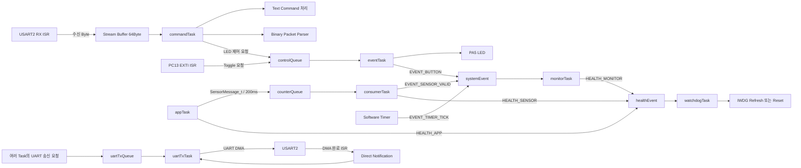
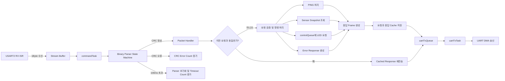

# STM32 FreeRTOS Sensor Controller

STM32F401RE에서 센서 데이터 수집, 장치 제어, UART 통신을  
FreeRTOS Task로 분리하고, 통신 오류와 Task 이상이 발생해도  
검출·복구할 수 있도록 구현한 개인 펌웨어 프로젝트입니다.

단순한 센서 동작 확인을 넘어 UART Binary Protocol의 CRC-16,  
Parser Timeout, Retry, 중복 요청 방지와 Task Health Monitoring,  
IWDG 기반 자동 복구 구조를 구현하고 반복 테스트로 안정성을 검증했습니다.

## 주요 결과

- UART Binary Protocol 자동 테스트 11개 구현
- 11개 테스트를 10회 반복하여 총 110/110 통과
- 정상 Packet 140개 처리 중 중복 요청 20개 감지 및 응답 재전송
- CRC 오류 10회와 Parser Timeout 10회 오류 주입 후 정상 복구
- UART RX Drop 0회, TX Queue Failure 0회
- FreeRTOS Free Heap과 Minimum Free Heap 5,464Byte 유지
- HC-SR04 ECHO 단선 시 Sensor Invalid 감지 후 재연결 자동 복구
- `appTask` 정지 시 IWDG Reset 발생 및 `RESET CAUSE: IWDG` 확인
- 부팅 시 RTOS 객체, OLED, EEPROM, RTC, 센서 Self-Test 전체 PASS

## 프로젝트 목표

STM32 주변장치 제어 실습에서 출발해, 여러 기능이 동시에 동작하는 환경에서  
데이터 전달, 통신 오류 처리, 자원 관리, 장애 복구까지 경험할 수 있는  
펌웨어 시스템을 구현하는 것을 목표로 했습니다.

현재 기능은 Bare-metal 구조로도 구현할 수 있지만, 센서 처리, 명령 파싱,  
출력 제어, 상태 모니터링, UART DMA 송신의 실행 책임과 Blocking 영향을  
분리하기 위해 FreeRTOS 기반 구조로 확장했습니다.

## 기술 스택

- **Language:** C, Python
- **MCU:** STM32F401RET6 / NUCLEO-F401RE
- **Framework:** STM32 HAL, FreeRTOS, CMSIS-RTOS2
- **Peripheral:** GPIO, UART, I2C, Timer, PWM, Input Capture, DMA, IWDG
- **RTOS:** Queue, Event Flag, Stream Buffer, Direct Task Notification
- **Protocol:** Binary Frame, CRC-16/CCITT-FALSE, Timeout, Retry, Duplicate Cache

## 시스템 요구사항

### 기능적 요구사항

- HC-SR04 거리 데이터를 주기적으로 측정하고 유효성을 판정
- OLED와 UART를 통해 센서 및 시스템 상태 제공
- UART Text Command와 Binary Protocol 동시 지원
- Binary 명령을 통한 상태 조회 및 LED 제어
- RTC, OLED, EEPROM 등 I2C 장치의 부팅 Self-Test
- 버튼 입력, LED, Buzzer, PWM 출력 등 주변장치 제어

### 신뢰성 요구사항

- UART RX ISR에서는 수신 Byte 저장과 다음 수신 등록만 수행
- Stream Buffer를 이용해 ISR과 명령 처리 Task 분리
- UART 송신은 전용 Task만 수행하는 Single Writer 구조 사용
- CRC-16을 이용해 손상된 Binary Packet 거부
- 불완전 Packet은 Parser Timeout 후 폐기하고 정상 상태로 복구
- 응답 유실 시 동일한 Sequence를 사용해 Retry
- 동일 요청 재수신 시 명령을 다시 실행하지 않고 Cached Response 재전송
- 주요 Task의 Health 상태가 모두 확인된 경우에만 IWDG Refresh
- 센서 단선과 Task 이상 발생 후 시스템 자동 복구
- Heap, Stack, RX Drop, TX Queue Failure 측정을 통한 안정성 확인

## 하드웨어 구성

| 부품 | 인터페이스 / 핀 | 용도 |
|---|---|---|
| NUCLEO-F401RE | STM32F401RET6, 84MHz | 메인 제어 보드 |
| HC-SR04 | TRIG: PB5, ECHO: PA6 / TIM3_CH1 | 초음파 거리 측정 |
| SSD1306 OLED | I2C1 PB8/PB9, 주소 0x3C | 센서값과 시스템 상태 표시 |
| DS3231 RTC | I2C1 PB8/PB9, 주소 0x68 | 날짜 및 시간 정보 제공 |
| RTC 모듈 내 EEPROM | I2C1 PB8/PB9, 주소 0x57 | I2C 장치 확인 및 저장 인터페이스 |
| KY-006 부저 | PB6 / TIM4_CH1 | PWM 경고음 출력 |
| SG90 서보모터 | PB10 / TIM2_CH3 | 50Hz PWM 제어 신호 출력 |
| NUCLEO LD2 | PA5 | Text 및 Binary 명령을 통한 LED 제어 |
| 사용자 버튼 | PC13 / EXTI | 외부 인터럽트 입력 |
| UART2 VCP | PA2 TX, PA3 RX | Text 명령, Binary Protocol, 디버그 로그 |
| USB 로직 애널라이저 | UART, I2C, PWM 신호선 | 통신 및 PWM 파형 검증 |

### 배선 및 전기적 고려사항

- 모든 모듈과 NUCLEO 보드의 GND를 공통으로 연결했습니다.
- HC-SR04는 5V 전원을 사용했습니다.
- HC-SR04의 ECHO 신호는 약 5V이므로, 10kΩ과 20kΩ 저항으로 전압 분배 회로를 구성해 약 3.3V로 낮춘 뒤 PA6에 입력했습니다.
- OLED, RTC, EEPROM은 I2C1 버스를 공유하도록 구성했습니다.
- I2C1 통신 속도는 100kHz로 설정했습니다.
- 서보모터 제어 신호는 50Hz PWM으로 구성했습니다.
- 외부 전원으로 서보모터를 구동할 경우 외부 전원 GND와 NUCLEO GND를 공통으로 연결해야 합니다.

## 소프트웨어 아키텍처

센서 처리, 명령 수신, 장치 제어, 상태 모니터링, UART 송신의 책임을  
각 Task로 분리했습니다.

Task 간 데이터 전달은 전역변수에 직접 의존하기보다 Queue, Event Flag,  
Stream Buffer, Direct Task Notification을 사용하도록 구성했습니다.

### 주요 Task 구성

| Task | 우선순위 | 주요 역할 | 사용 RTOS 객체 |
|---|---|---|---|
| `appTask` | Normal | 애플리케이션 주기 실행, 센서 Snapshot 생성 및 전달 | `counterQueue`, `healthEvent` |
| `commandTask` | Normal | UART Text 명령 처리, Binary Packet 파싱, 제어 요청 생성 | `uartRxStreamBuffer`, `controlQueue` |
| `eventTask` | Below Normal | 버튼 및 명령으로 전달된 LED 제어 요청 처리 | `controlQueue`, `systemEvent` |
| `consumerTask` | Below Normal | 센서 메시지 수신 및 센서 유효 상태 반영 | `counterQueue`, `systemEvent`, `healthEvent` |
| `monitorTask` | Low | 주기 이벤트와 버튼 이벤트 확인, 시스템 상태 로그 출력 | `systemEvent`, `healthEvent` |
| `uartTxTask` | Normal | UART TX Queue를 단독 소비하고 DMA 송신 수행 | `uartTxQueue`, Direct Notification |
| `watchdogTask` | Normal | 주요 Task의 Health Bit 확인 후 IWDG 갱신 | `healthEvent` |

### 전체 데이터 흐름



### 설계 원칙

- UART RX ISR에서는 수신 Byte를 Stream Buffer에 저장하고 다음 수신을 등록하는 최소 작업만 수행했습니다.
- 문자열 파싱, Binary Packet 조립, CRC 검사, 로그 출력은 `commandTask`에서 수행합니다.
- 여러 Task가 UART HAL 함수를 직접 호출하지 않도록 `uartTxTask`만 UART DMA를 사용하는 Single Writer 구조를 적용했습니다.
- 센서 데이터는 생산자와 소비자의 실행 시점을 분리하기 위해 `counterQueue`로 전달합니다.
- LED 제어 요청은 명령 처리와 실제 GPIO 제어 책임을 분리하기 위해 `controlQueue`로 전달합니다.
- 상태 변화와 주기 이벤트는 데이터 자체보다 발생 여부가 중요하므로 Event Flag를 사용했습니다.
- UART DMA 완료 신호는 별도 Semaphore 대신 Direct Task Notification으로 전달했습니다.

## UART Binary Protocol

Text 명령과 별도로 길이 기반 Binary Protocol을 구현했습니다.

문자열 종료 문자에 의존하지 않고 `Length` 필드를 기준으로 Payload를 처리하며,  
CRC-16, Parser Timeout, Retry, 중복 요청 방지를 적용해 통신 신뢰성을 높였습니다.

### Packet 구조

| 필드 | 크기 | 설명 |
|---|---:|---|
| SOF1 | 1Byte | 시작 Byte `0xAA` |
| SOF2 | 1Byte | 시작 Byte `0x55` |
| Version | 1Byte | Protocol Version, 현재 `0x01` |
| Type | 1Byte | 요청 또는 응답 종류 |
| Sequence | 1Byte | 요청과 응답을 식별하는 번호 |
| Length | 1Byte | Payload 길이, 최대 32Byte |
| Payload | 0~32Byte | 명령 또는 응답 데이터 |
| CRC Low | 1Byte | CRC 하위 Byte |
| CRC High | 1Byte | CRC 상위 Byte |

```text
AA 55 | VERSION | TYPE | SEQUENCE | LENGTH | PAYLOAD | CRC_LOW CRC_HIGH
```

CRC 계산 대상에는 SOF를 제외한 다음 필드를 포함합니다.

```text
VERSION + TYPE + SEQUENCE + LENGTH + PAYLOAD
```

### CRC 설정

- **알고리즘:** CRC-16/CCITT-FALSE
- **Polynomial:** `0x1021`
- **Initial Value:** `0xFFFF`
- **Final XOR:** `0x0000`
- **Input/Output Reflection:** 사용하지 않음
- **전송 순서:** Low Byte 먼저 전송

SOF는 Parser가 Packet 경계를 탐색하는 용도로 사용하고,  
실제 Packet 내용의 무결성은 Version부터 Payload까지 검증하도록 구분했습니다.

### 요청 Packet

| Type | 값 | 설명 |
|---|---:|---|
| `PING` | `0x01` | 통신 연결 확인 |
| `GET_STATUS` | `0x02` | 센서 상태 조회 |
| `LED_SET` | `0x03` | LED ON/OFF 제어 |

### 응답 Packet

| Type | 값 | 설명 |
|---|---:|---|
| `PONG` | `0x81` | PING 정상 응답 |
| `STATUS` | `0x82` | 거리값과 센서 유효 상태 응답 |
| `ACK` | `0x83` | 제어 명령 접수 성공 |
| `ERROR` | `0xFF` | 요청 형식 또는 처리 오류 |

### Error Code

| Error Code | 값 | 발생 조건 |
|---|---:|---|
| `OK` | `0x00` | 정상 처리 |
| `INVALID_LENGTH` | `0x01` | 요청 Payload 길이가 잘못된 경우 |
| `INVALID_PAYLOAD` | `0x02` | 허용되지 않은 Payload 값 |
| `UNKNOWN_TYPE` | `0x03` | 정의되지 않은 Packet Type |
| `SNAPSHOT_FAILED` | `0x04` | 센서 Snapshot을 읽지 못한 경우 |
| `CONTROL_QUEUE_FULL` | `0x05` | 제어 Queue에 명령을 넣지 못한 경우 |

### Binary Packet 처리 흐름



## 통신 오류 처리

### 1. CRC 오류 검출

수신 완료된 Packet의 CRC를 계산한 뒤 수신 CRC와 비교합니다.

CRC가 일치하지 않으면 다음과 같이 처리합니다.

- Packet Handler를 호출하지 않음
- 명령을 실행하지 않음
- 응답을 전송하지 않음
- CRC Error Count 증가
- Parser를 초기 상태로 복구

손상된 명령이 실제 장치 제어로 이어지지 않도록 검증과 실행 단계를 분리했습니다.

### 2. 불완전 Packet Timeout

SOF 수신 후 Packet이 완성되지 않은 상태가 100ms 이상 지속되면  
부분 Packet을 폐기하고 Parser를 초기 상태로 되돌립니다.

`commandTask`는 Stream Buffer를 최대 20ms 동안 대기하며,  
수신 데이터가 없더라도 `UartProtocol_CheckTimeout()`을 호출해  
Parser Timeout을 검사합니다.

이를 통해 중간에 끊긴 Packet 때문에 다음 정상 Packet까지  
잘못 해석되는 문제를 방지했습니다.

### 3. 응답 유실 시 Retry

Python 테스트 프로그램은 응답이 0.5초 안에 도착하지 않으면  
동일 요청을 최대 3회까지 재전송합니다.

Retry 시에는 새로운 Sequence를 만들지 않고 기존 Sequence를 유지합니다.

```text
첫 번째 요청 : TYPE 0x01 / SEQ 0x50
재전송 요청  : TYPE 0x01 / SEQ 0x50
```

동일한 Sequence를 사용해야 MCU가 같은 논리적 요청의 재전송인지  
판단할 수 있습니다.

### 4. 중복 명령 실행 방지

Retry 요청을 그대로 다시 실행하면 LED 제어와 같은 명령이  
두 번 수행될 수 있습니다.

이를 방지하기 위해 가장 최근의 요청과 응답 Frame을 Cache에 저장합니다.

다음 항목이 모두 같을 때 중복 요청으로 판단합니다.

- Version
- Type
- Sequence
- Length
- Payload

중복 요청이면 Packet Handler의 명령 처리 코드를 다시 실행하지 않고,  
저장된 응답 Frame만 재전송합니다.

```text
첫 번째 요청
→ 명령 실행
→ 응답 생성
→ 요청과 응답 Cache 저장

동일 요청 Retry
→ 중복 요청 감지
→ 명령 재실행하지 않음
→ Cached Response만 재전송
```

Sequence가 같더라도 Payload가 다르면 새로운 요청으로 처리합니다.

### 5. UART 송신 실패 측정

모든 Binary Frame 송신은 공통 Queue 함수를 거치도록 구성했습니다.

`uartTxQueue` 등록에 실패하면 `TX FAIL` 카운터를 증가시켜  
송신 경로의 오류 발생 여부를 확인할 수 있도록 했습니다.

## 통신 진단 통계

PuTTY에서 다음 명령으로 누적 통계를 확인할 수 있습니다.

```text
PKT STAT
```

| 항목 | 의미 |
|---|---|
| `VALID` | CRC 검증을 통과해 Handler까지 전달된 Packet 수 |
| `DUPLICATE` | 중복 요청으로 감지된 Packet 수 |
| `CRC ERROR` | CRC가 일치하지 않은 Packet 수 |
| `TIMEOUT` | 완성되지 못하고 Timeout 처리된 Packet 수 |
| `RX DROP` | Stream Buffer에 저장하지 못한 UART 수신 Byte 수 |
| `TX FAIL` | UART TX Queue 등록 실패 횟수 |

10회 반복 테스트 후 측정 결과는 다음과 같습니다.

```text
VALID 140 | DUPLICATE 20
CRC ERROR 10 | TIMEOUT 10 | RX DROP 0 | TX FAIL 0
```