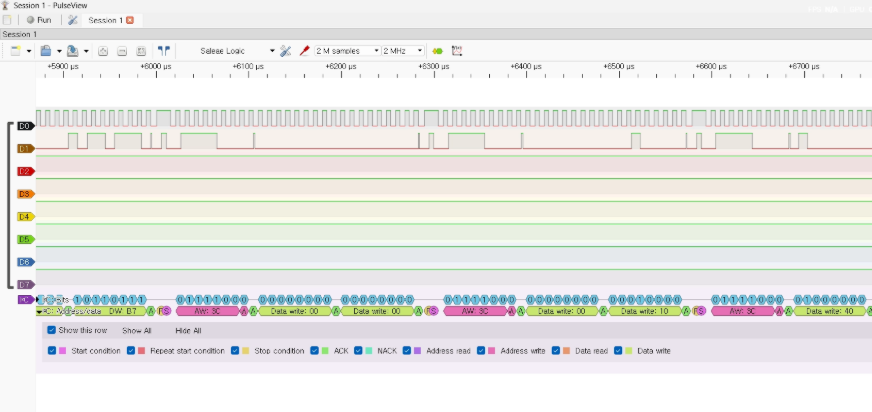
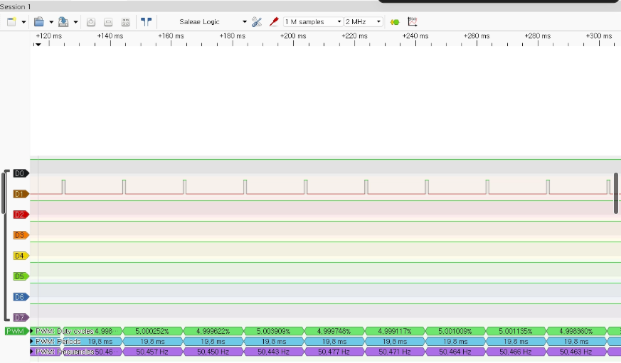
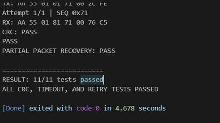
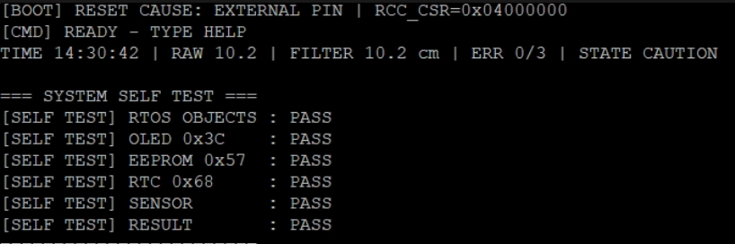
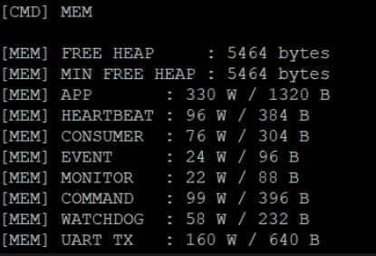
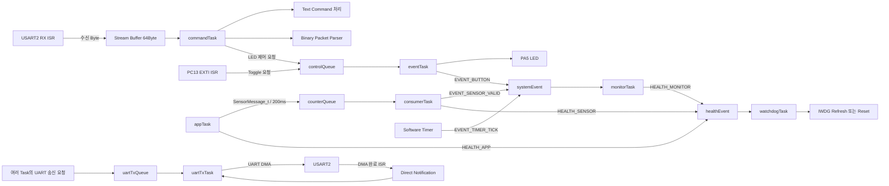

# STM32 FreeRTOS Sensor Controller

STM32F401RE에서 센서 데이터 수집, 장치 제어, UART 통신을
FreeRTOS Task로 분리하고, 통신 오류와 Task 이상이 발생해도
검출·복구할 수 있도록 구현한 개인 펌웨어 프로젝트입니다.

단순한 센서 동작 확인을 넘어
**UART Binary Protocol의 오류 처리, RTOS 기반 Task 분리,
UART DMA 송신 구조, Watchdog 및 Self-Test, 반복 자동 테스트**까지 구현했습니다.

---

## 핵심 구현

- STM32F401RE 기반 HC-SR04 거리 측정 및 OLED·RTC·LED·Buzzer 제어
- FreeRTOS Task 기반 센서 처리, 명령 파싱, 상태 모니터링, UART 송신 분리
- Queue, Event Flag, Stream Buffer, Direct Task Notification을 이용한 Task 간 데이터 전달
- UART Binary Protocol에 CRC-16, Parser Timeout, Retry, Duplicate Request 방지 적용
- 여러 Task의 UART DMA 충돌을 방지하기 위한 `uartTxTask` Single Writer 구조 적용
- IWDG 기반 Task Health Monitoring 및 부팅 Self-Test 구현

## 검증 결과

- Python Binary Protocol 자동 테스트 **11개 × 10회 = 110/110 PASS**
- CRC 오류 및 Parser Timeout 오류 주입 후 다음 정상 Packet 처리 확인
- Duplicate Request 감지 시 명령 재실행 없이 Cached Response 재전송
- UART RX Drop **0회**, TX Queue Failure **0회**
- Free Heap / Minimum Free Heap **5,464 Byte 유지**
- HC-SR04 ECHO 단선 감지 후 재연결 시 자동 복구
- `appTask` 정지 시 IWDG Reset 및 `RESET CAUSE: IWDG` 확인
- RTOS 객체, OLED, EEPROM, RTC, Sensor 부팅 Self-Test PASS

---

## Hardware & Verification

### Hardware Setup

<p align="center">
  
</p>

NUCLEO-F401RE에 HC-SR04, SSD1306 OLED, DS3231 RTC 등 주변장치를 연결해
실제 하드웨어 환경에서 기능과 오류 복구 동작을 검증했습니다.

### I2C Logic Analyzer



로직 애널라이저를 이용해 I2C SCL/SDA 신호와 ACK를 확인하며
OLED 및 RTC 계열 장치의 실제 통신 상태를 검증했습니다.

### PWM Verification



Timer PWM 출력의 약 20ms 주기(약 50Hz)를 로직 애널라이저로 측정해
설정한 PWM 주기가 실제 핀에서 출력되는 것을 확인했습니다.

### Protocol Automation Test



Python 테스트 프로그램을 이용해 정상 Packet뿐 아니라 CRC 오류,
부분 Packet Timeout, Retry, Duplicate Request 등 오류 조건을 자동 검증했습니다.

### Self-Test



부팅 및 명령 실행 시 RTOS 객체와 I2C 주변장치,
센서 준비 상태를 확인하는 Self-Test를 구현했습니다.

### FreeRTOS Memory Monitoring



Free Heap과 각 Task의 Stack High Water Mark를 측정해
RTOS 자원 사용량을 확인했습니다.

---

## 프로젝트 목표

STM32 주변장치 제어 실습에서 출발해, 여러 기능이 동시에 동작하는 환경에서  
데이터 전달, 통신 오류 처리, 자원 관리, 장애 복구까지 경험할 수 있는  
펌웨어 시스템을 구현하는 것을 목표로 했습니다.

현재 기능은 Bare-metal 구조로도 구현할 수 있지만, 센서 처리, 명령 파싱,  
출력 제어, 상태 모니터링, UART DMA 송신의 실행 책임과 Blocking 영향을  
분리하기 위해 FreeRTOS 기반 구조로 확장했습니다.

## 기술 스택

- **Language:** C, Python
- **MCU:** STM32F401RET6 / NUCLEO-F401RE
- **Framework:** STM32 HAL, FreeRTOS, CMSIS-RTOS2
- **Peripheral:** GPIO, UART, I2C, Timer, PWM, Input Capture, DMA, IWDG
- **RTOS:** Queue, Event Flag, Stream Buffer, Direct Task Notification
- **Protocol:** Binary Frame, CRC-16/CCITT-FALSE, Timeout, Retry, Duplicate Cache

## 시스템 요구사항

### 기능적 요구사항

- HC-SR04 거리 데이터를 주기적으로 측정하고 유효성을 판정
- OLED와 UART를 통해 센서 및 시스템 상태 제공
- UART Text Command와 Binary Protocol 동시 지원
- Binary 명령을 통한 상태 조회 및 LED 제어
- RTC, OLED, EEPROM 등 I2C 장치의 부팅 Self-Test
- 버튼 입력, LED, Buzzer, PWM 출력 등 주변장치 제어

### 신뢰성 요구사항

- UART RX ISR에서는 수신 Byte 저장과 다음 수신 등록만 수행
- Stream Buffer를 이용해 ISR과 명령 처리 Task 분리
- UART 송신은 전용 Task만 수행하는 Single Writer 구조 사용
- CRC-16을 이용해 손상된 Binary Packet 거부
- 불완전 Packet은 Parser Timeout 후 폐기하고 정상 상태로 복구
- 응답 유실 시 동일한 Sequence를 사용해 Retry
- 동일 요청 재수신 시 명령을 다시 실행하지 않고 Cached Response 재전송
- 주요 Task의 Health 상태가 모두 확인된 경우에만 IWDG Refresh
- 센서 단선과 Task 이상 발생 후 시스템 자동 복구
- Heap, Stack, RX Drop, TX Queue Failure 측정을 통한 안정성 확인

## 하드웨어 구성

| 부품 | 인터페이스 / 핀 | 용도 |
|---|---|---|
| NUCLEO-F401RE | STM32F401RET6, 84MHz | 메인 제어 보드 |
| HC-SR04 | TRIG: PB5, ECHO: PA6 / TIM3_CH1 | 초음파 거리 측정 |
| SSD1306 OLED | I2C1 PB8/PB9, 주소 0x3C | 센서값과 시스템 상태 표시 |
| DS3231 RTC | I2C1 PB8/PB9, 주소 0x68 | 날짜 및 시간 정보 제공 |
| RTC 모듈 내 EEPROM | I2C1 PB8/PB9, 주소 0x57 | I2C 장치 확인 및 저장 인터페이스 |
| KY-006 부저 | PB6 / TIM4_CH1 | PWM 경고음 출력 |
| SG90 서보모터 | PB10 / TIM2_CH3 | 50Hz PWM 제어 신호 출력 |
| NUCLEO LD2 | PA5 | Text 및 Binary 명령을 통한 LED 제어 |
| 사용자 버튼 | PC13 / EXTI | 외부 인터럽트 입력 |
| UART2 VCP | PA2 TX, PA3 RX | Text 명령, Binary Protocol, 디버그 로그 |
| USB 로직 애널라이저 | UART, I2C, PWM 신호선 | 통신 및 PWM 파형 검증 |

### 배선 및 전기적 고려사항

- 모든 모듈과 NUCLEO 보드의 GND를 공통으로 연결했습니다.
- HC-SR04는 5V 전원을 사용했습니다.
- HC-SR04의 ECHO 신호는 약 5V이므로, 10kΩ과 20kΩ 저항으로 전압 분배 회로를 구성해 약 3.3V로 낮춘 뒤 PA6에 입력했습니다.
- OLED, RTC, EEPROM은 I2C1 버스를 공유하도록 구성했습니다.
- I2C1 통신 속도는 100kHz로 설정했습니다.
- 서보모터 제어 신호는 50Hz PWM으로 구성했습니다.
- 외부 전원으로 서보모터를 구동할 경우 외부 전원 GND와 NUCLEO GND를 공통으로 연결해야 합니다.

## 소프트웨어 아키텍처

센서 처리, 명령 수신, 장치 제어, 상태 모니터링, UART 송신의 책임을  
각 Task로 분리했습니다.

Task 간 데이터 전달은 전역변수에 직접 의존하기보다 Queue, Event Flag,  
Stream Buffer, Direct Task Notification을 사용하도록 구성했습니다.

### 주요 Task 구성

| Task | 우선순위 | 주요 역할 | 사용 RTOS 객체 |
|---|---|---|---|
| `appTask` | Normal | 애플리케이션 주기 실행, 센서 Snapshot 생성 및 전달 | `counterQueue`, `healthEvent` |
| `commandTask` | Normal | UART Text 명령 처리, Binary Packet 파싱, 제어 요청 생성 | `uartRxStreamBuffer`, `controlQueue` |
| `eventTask` | Below Normal | 버튼 및 명령으로 전달된 LED 제어 요청 처리 | `controlQueue`, `systemEvent` |
| `consumerTask` | Below Normal | 센서 메시지 수신 및 센서 유효 상태 반영 | `counterQueue`, `systemEvent`, `healthEvent` |
| `monitorTask` | Low | 주기 이벤트와 버튼 이벤트 확인, 시스템 상태 로그 출력 | `systemEvent`, `healthEvent` |
| `uartTxTask` | Normal | UART TX Queue를 단독 소비하고 DMA 송신 수행 | `uartTxQueue`, Direct Notification |
| `watchdogTask` | Normal | 주요 Task의 Health Bit 확인 후 IWDG 갱신 | `healthEvent` |

### 전체 데이터 흐름



### 설계 원칙

- UART RX ISR에서는 수신 Byte를 Stream Buffer에 저장하고 다음 수신을 등록하는 최소 작업만 수행했습니다.
- 문자열 파싱, Binary Packet 조립, CRC 검사, 로그 출력은 `commandTask`에서 수행합니다.
- 여러 Task가 UART HAL 함수를 직접 호출하지 않도록 `uartTxTask`만 UART DMA를 사용하는 Single Writer 구조를 적용했습니다.
- 센서 데이터는 생산자와 소비자의 실행 시점을 분리하기 위해 `counterQueue`로 전달합니다.
- LED 제어 요청은 명령 처리와 실제 GPIO 제어 책임을 분리하기 위해 `controlQueue`로 전달합니다.
- 상태 변화와 주기 이벤트는 데이터 자체보다 발생 여부가 중요하므로 Event Flag를 사용했습니다.
- UART DMA 완료 신호는 별도 Semaphore 대신 Direct Task Notification으로 전달했습니다.

## UART Binary Protocol

문자열 종료 문자에 의존하지 않는 길이 기반 Binary Protocol을 구현했습니다.

```text
SOF | VERSION | TYPE | SEQUENCE | LENGTH | PAYLOAD | CRC
```

- CRC-16/CCITT-FALSE를 이용한 손상 Packet 검출
- 100ms Parser Timeout을 통한 부분 Packet 복구
- 응답 유실 시 동일 Sequence로 최대 3회 Retry
- 동일 요청 재수신 시 명령을 다시 실행하지 않고 Cached Response 재전송
- UART RX Drop과 TX Queue Failure 통계 측정

자세한 Packet 구조, Error Code, Parser 처리 과정은  
[UART Binary Protocol 상세 문서](docs/protocol.md)에서 확인할 수 있습니다.

## 핵심 문제 해결

### ASCII와 Binary 데이터 혼동

HEX 문자열 `"AA"`는 실제 Binary `0xAA`가 아니라 ASCII `0x41 0x41`로 전송되는 문제를 확인했습니다.  
Python에서 실제 Byte 배열을 전송하고, MCU에서는 종료 문자가 아닌 `Length` 기반 Parser로 변경했습니다.

### Retry 중복 실행 방지

첫 번째 요청의 응답만 유실된 경우 Retry 요청이 제어 명령을 다시 실행할 수 있었습니다.  
최근 요청과 응답을 Cache에 저장하고, 동일 요청이면 명령을 재실행하지 않고 기존 응답만 전송했습니다.

### UART DMA 송신 통합

여러 Task가 UART DMA를 직접 호출할 때 `HAL_BUSY`, Buffer 수명, 송신 순서 문제가 발생할 수 있었습니다.  
모든 송신 요청을 Queue로 전달하고 `uartTxTask`만 DMA를 사용하는 Single Writer 구조로 통합했습니다.

자세한 원인 분석과 검증 과정은  
[핵심 문제 해결 상세 문서](docs/troubleshooting.md)에서 확인할 수 있습니다.


## 검증 결과

Python 자동 테스트와 오류 주입 시험을 통해 통신 및 장애 복구 동작을 검증했습니다.

| 검증 항목 | 결과 |
|---|---|
| Binary Protocol 테스트 | 11개 테스트 × 10회, 총 110/110 PASS |
| 통신 오류 주입 | CRC 오류 10회, Parser Timeout 10회 정상 복구 |
| 중복 요청 처리 | 20개 감지, 명령 재실행 없이 응답 재전송 |
| UART 안정성 | RX Drop 0회, TX Queue Failure 0회 |
| 센서 복구 | ECHO 단선 감지 후 재연결 자동 복구 |
| Watchdog | `appTask` 정지 후 IWDG Reset 확인 |
| 메모리 | Free Heap과 Minimum Free Heap 5,464Byte 유지 |

상세 테스트 절차와 Stack 측정 결과는  
[검증 및 테스트 상세 문서](docs/test-results.md)에서 확인할 수 있습니다.

## 현재 한계와 향후 개선 계획

현재 프로젝트는 기능 구현과 오류 복구 검증까지 완료했지만,
다음과 같은 한계가 있습니다.

### 현재 한계

- Duplicate Request Cache는 가장 최근 Transaction 1개만 보관
- Watchdog Health Monitoring은 일부 주요 Task만 대상으로 적용
- Protocol 통계는 RAM Counter로 관리되어 Reset 시 초기화
- 자동 테스트는 단일 NUCLEO-F401RE와 UART 연결 환경 중심으로 수행
- `eventTask`, `monitorTask`는 Stack High Water Mark가 각각 24Word, 22Word로 측정되어 기능 확장 시 재측정 필요

### 향후 개선

- 여러 요청을 일정 시간 보관하는 다중 Transaction Cache 적용
- Task별 실행 주기를 고려한 Health Timeout 기반 Watchdog 확장
- Parser Fuzz Test, 경계값, Queue 포화, 장시간 반복 통신 시험 추가
- Protocol 로직을 하드웨어 의존 코드와 분리해 Host 환경 Unit Test 적용

상세 테스트 결과와 측정값은
[검증 및 테스트 상세 문서](docs/test-results.md)에서 확인할 수 있습니다.
## 빌드 및 실행 방법

### 개발 환경

- Windows 11
- STM32CubeIDE
- STM32CubeMX
- NUCLEO-F401RE 내장 ST-LINK
- PuTTY 또는 UART Serial Terminal
- Python 3 

### 프로젝트 가져오기

저장소를 Clone합니다.

```bash
git clone https://github.com/Gun98/STM32-FreeRTOS-Sensor-Controller.git
```

STM32CubeIDE에서 다음 순서로 프로젝트를 가져옵니다.

```text
File
→ Import
→ General
→ Existing Projects into Workspace
→ Clone한 프로젝트 폴더 선택
→ Finish
```

프로젝트 설정은 `HCSR04_DISTANCE.ioc` 파일에서 확인할 수 있습니다.

### 빌드

STM32CubeIDE에서 프로젝트를 선택한 뒤 다음 방법으로 빌드합니다.

```text
Project
→ Build Project
```

또는 상단의 망치 모양 Build 버튼을 사용합니다.

빌드가 정상적으로 완료되면 Console에서 다음 결과를 확인합니다.

```text
0 errors
```

### 보드에 다운로드

1. NUCLEO-F401RE를 USB로 PC에 연결합니다.
2. STM32CubeIDE에서 Run 또는 Debug를 실행합니다.
3. 내장 ST-LINK를 통해 Firmware를 보드에 다운로드합니다.
4. Reset 후 부팅 로그와 Self-Test 결과를 확인합니다.

### UART 연결

USART2는 NUCLEO 보드의 ST-LINK Virtual COM Port를 통해 PC와 연결됩니다.

Serial Terminal 설정은 다음과 같습니다.

```text
Port         : 장치 관리자에서 확인한 ST-LINK COM Port
Baud Rate    : CubeMX의 USART2 설정값과 동일하게 설정
Data Bits    : 8
Parity       : None
Stop Bits    : 1
Flow Control : None
```

현재 개발 환경에서는 `COM7`을 사용했지만,  
PC 연결 상태에 따라 COM Port 번호는 달라질 수 있습니다.

## 주요 Text 명령어

### Self-Test 결과 확인

```text
SELF TEST
```

RTOS 객체, OLED, EEPROM, RTC, 센서의 준비 상태를 다시 검사합니다.

예시:

```text
=== SYSTEM SELF TEST ===
[SELF TEST] RTOS OBJECTS : PASS
[SELF TEST] OLED 0x3C    : PASS
[SELF TEST] EEPROM 0x57  : PASS
[SELF TEST] RTC 0x68     : PASS
[SELF TEST] SENSOR       : PASS
[SELF TEST] RESULT       : PASS
========================
```

### Binary Protocol 통계 확인

```text
PKT STAT
```

다음 통계를 확인할 수 있습니다.

```text
VALID 140 | DUPLICATE 20
CRC ERROR 10 | TIMEOUT 10 | RX DROP 0 | TX FAIL 0
```

### Watchdog 복구 시험

```text
FAULT WATCHDOG
```

이 명령은 디버깅 목적으로 `appTask`의 정상 실행을 중단해  
IWDG Reset이 실제로 발생하는지 확인합니다.

```text
FAULT WATCHDOG 입력
→ appTask Health 미보고
→ IWDG Refresh 중단
→ Watchdog Reset
→ 시스템 재부팅
→ RESET CAUSE: IWDG 출력
```

> `FAULT WATCHDOG`는 의도적으로 시스템 Reset을 발생시키는 시험용 명령입니다.

## 프로젝트 실행 확인 순서

```text
1. 보드와 주변장치 배선 확인
2. STM32CubeIDE에서 Build
3. ST-LINK를 이용해 Firmware 다운로드
4. UART Terminal 연결
5. 부팅 Self-Test 결과 확인
6. 센서 거리값과 OLED 출력 확인
7. SELF TEST 명령 실행
8. Python Binary Protocol 자동 테스트 실행
9. PKT STAT 통계 확인
10. 필요 시 센서 단선 및 Watchdog 복구 시험 수행
```


