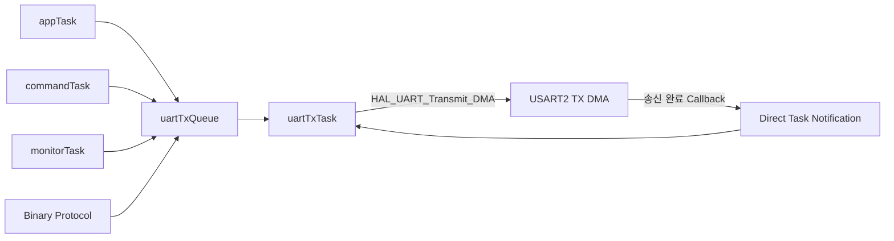

# 핵심 문제 해결 사례

이 문서는 프로젝트를 진행하면서 발생한 주요 문제와 원인 분석, 수정 방법, 검증 결과를 정리한 문서입니다.

## 1. ASCII 문자열 전송에서 길이 기반 Binary Protocol로 개선

### 문제 상황

초기 UART 통신에서는 사람이 읽을 수 있는 문자열 중심으로 명령을 처리했습니다.

Binary Packet을 구현하면서 다음 두 데이터가 서로 다른 Byte로 전송된다는 점을 확인했습니다.

```text
문자열 "AA"
→ ASCII Byte: 0x41 0x41

실제 Binary 값 0xAA
→ Binary Byte: 0xAA
```

HEX 형태로 보이는 문자열을 전송해도 MCU에는 실제 Binary 값이 아니라 각 문자의 ASCII 코드가 수신됐습니다.

그 결과 Parser는 SOF인 `0xAA`를 찾지 못하고 Packet을 정상적으로 조립하지 못했습니다.

### 원인 분석

문자열 `"AA"`는 문자 `A` 두 개로 구성됩니다.

ASCII에서 문자 `A`는 `0x41`이므로 실제 UART 전송 데이터는 다음과 같습니다.

```text
41 41
```

반면 Binary SOF 값인 `0xAA`는 하나의 Byte입니다.

```text
AA
```

Terminal 화면이나 로그에서 HEX 형태로 비슷하게 표현되더라도 실제 메모리에 저장된 데이터 형식이 문자열인지 Binary Byte인지 구분해야 했습니다.

또한 문자열 통신은 `\r`, `\n`, `\0`과 같은 종료 문자를 기준으로 명령을 구분할 수 있지만, Binary Payload에는 동일한 값이 정상 데이터로 포함될 수 있습니다.

따라서 문자열 종료 방식으로는 Binary Packet의 정확한 경계를 판단하기 어렵다고 분석했습니다.

### 수정 방법

고정된 SOF와 `Length` 필드를 사용하는 Binary Frame 구조로 변경했습니다.

```text
SOF | VERSION | TYPE | SEQUENCE | LENGTH | PAYLOAD | CRC
```

MCU Parser는 `Length` 값을 기준으로 Payload 수신 완료 여부를 판단하도록 구성했습니다.

```text
SOF 탐색
→ Header 수신
→ Length 확인
→ Length만큼 Payload 수신
→ CRC 수신
→ CRC 검증
→ 명령 실행
```

Python 테스트 프로그램에서도 문자열 형태의 HEX 값을 전송하지 않고 `bytes` 객체로 실제 Binary Byte 배열을 생성해 UART로 전송했습니다.

예시:

```python
packet = bytes([
    0xAA,
    0x55,
    0x01,
    0x01,
    0x10,
    0x00,
    0x37,
    0xC6,
])

serial_port.write(packet)
```

### 검증 방법

- PING Packet 전송 후 PONG 응답 확인
- 상태 조회 Packet 전송 후 거리값과 센서 상태 확인
- LED ON/OFF Binary 명령 실행
- CRC가 손상된 Packet 폐기 여부 확인
- Payload 내부에 특정 값이 포함돼도 Length 기준으로 처리되는지 확인

### 검증 결과

- PING, 상태 조회, LED 제어 Binary Packet 정상 처리
- Payload 값을 종료 문자로 잘못 판단하지 않음
- `Length` 기준으로 Packet 조립
- CRC-16 검증을 통해 손상 Packet 실행 차단
- Python 자동 테스트 11개 통과

### 배운 점

통신 로그에 같은 HEX 값이 표시되더라도 실제 데이터가 문자열인지 Binary인지 구분해야 한다는 점을 배웠습니다.

Binary Protocol에서는 종료 문자보다 명시적인 길이 정보와 상태 기반 Parser가 더 적합하다는 것을 확인했습니다.

---

## 2. Retry 요청에 의한 명령 중복 실행 방지

### 문제 상황

PC가 요청을 전송한 뒤 MCU의 응답을 받지 못하면 같은 요청을 Retry하도록 구성했습니다.

하지만 첫 번째 요청이 MCU에서 이미 처리됐고 응답만 유실된 상황이라면, 재전송된 요청을 다시 실행하면서 LED 제어와 같은 명령이 중복 수행될 수 있었습니다.

```text
첫 번째 요청
→ MCU에서 명령 실행
→ 응답 전송
→ PC가 응답을 받지 못함

Retry 요청
→ 같은 명령을 다시 실행할 가능성
```

PING이나 상태 조회는 반복 실행돼도 부작용이 작지만, 출력 제어 명령은 중복 실행 여부를 명확하게 관리해야 했습니다.

### 원인 분석

초기 Retry 구조에서는 PC가 같은 Sequence로 요청을 다시 보내더라도 MCU가 이를 새로운 요청과 구분하지 않고 Packet Handler를 다시 실행했습니다.

Sequence만 비교하는 방식도 충분하지 않았습니다.

Sequence는 1Byte 값이므로 반복 사용될 수 있고, 같은 Sequence를 가진 다른 Type이나 Payload가 들어올 수 있기 때문입니다.

```text
SEQ 0x20 / LED ON
SEQ 0x20 / LED OFF
```

두 요청은 Sequence는 같지만 Payload가 다르므로 서로 다른 요청으로 처리해야 합니다.

### 수정 방법

가장 최근에 처리한 요청 Packet과 해당 응답 Frame을 Cache에 저장했습니다.

다음 항목이 모두 같을 때만 동일 요청의 Retry로 판단하도록 구성했습니다.

- Version
- Type
- Sequence
- Length
- Payload

중복 요청으로 판단되면 명령 처리 코드에 다시 진입하지 않고 Cache에 저장된 이전 응답 Frame만 `uartTxQueue`로 전송합니다.

```text
신규 요청
→ 명령 실행
→ 응답 Frame 생성
→ 요청과 응답 Cache 저장
→ 응답 전송

동일 요청 Retry
→ Cache와 요청 비교
→ 명령 재실행 생략
→ Cached Response 재전송
```

응답을 TX Queue에 넣지 못하더라도 명령은 이미 실행됐을 수 있습니다.

따라서 응답 Frame Encode가 성공하면 실제 Queue 전송보다 먼저 요청과 응답을 Cache에 저장하도록 구성했습니다.

### 검증 방법

Python 자동 테스트에 다음 항목을 추가했습니다.

- 같은 LED ON 요청을 연속으로 두 번 전송
- 첫 번째 응답과 중복 요청 응답의 Frame 비교
- 같은 Sequence에서 Payload만 변경해 LED ON과 LED OFF 전송
- 첫 응답을 PC에서 의도적으로 무시하고 Retry 수행
- MCU의 `DUPLICATE` 통계 증가 여부 확인

### 검증 결과

- 동일 요청 Retry 시 명령 재실행 없이 Cached Response 재전송
- 같은 Sequence라도 Payload가 다르면 새로운 요청으로 처리
- 자동 테스트 10회 반복에서 중복 요청 20개 정상 감지
- 전체 자동 테스트 110/110 통과
- UART RX Drop 0회
- UART TX Queue Failure 0회

```text
VALID 140 | DUPLICATE 20
CRC ERROR 10 | TIMEOUT 10 | RX DROP 0 | TX FAIL 0
```

### 배운 점

Retry는 단순히 같은 Packet을 다시 전송하는 기능만으로 끝나지 않고, 이미 실행된 명령의 부작용까지 고려해야 한다는 점을 배웠습니다.

요청 식별에는 Sequence만 사용하는 것보다 Type, Length, Payload까지 함께 비교해야 안전하다는 것을 확인했습니다.

### 현재 한계

현재 Cache에는 가장 최근의 요청과 응답 한 쌍만 저장합니다.

여러 요청이 연속으로 처리된 뒤 이전 요청이 다시 도착하면 Cache에 남아 있지 않아 새로운 요청으로 처리될 수 있습니다.

향후에는 여러 Transaction을 일정 시간 동안 유지하는 다중 Cache 구조로 확장할 수 있습니다.

---

## 3. 여러 Task의 UART 송신을 Single Writer 구조로 통합

### 문제 상황

센서 로그, 상태 출력, Text 명령 응답, Binary Protocol 응답 등 여러 Task에서 UART 송신이 필요했습니다.

각 Task가 직접 `HAL_UART_Transmit_DMA()`를 호출할 경우 다음 문제가 발생할 수 있었습니다.

- 이전 DMA 송신이 끝나기 전에 새로운 송신 요청 발생
- `HAL_BUSY` 반환으로 메시지 누락
- DMA 송신 완료 전에 Buffer 내용이 변경되는 문제
- Text 로그와 Binary 응답이 섞이는 문제
- 송신 완료 대기 코드가 여러 Task에 중복되는 문제
- UART 상태 관리 책임이 여러 위치에 분산되는 문제

특히 Text 로그와 Binary Protocol 응답을 동시에 지원하면서 송신 순서와 Buffer 수명을 한곳에서 관리할 필요가 있었습니다.

### 원인 분석

UART와 DMA는 여러 Task가 동시에 독립적으로 사용할 수 있는 자원이 아닙니다.

한 Task가 UART DMA 송신을 시작한 상태에서 다른 Task가 다시 DMA 송신을 요청하면 UART 상태가 Busy이기 때문에 정상적으로 시작되지 않을 수 있습니다.

또한 DMA는 함수 호출이 끝난 뒤에도 Buffer를 계속 읽습니다.

지역 배열의 주소를 DMA에 전달한 뒤 함수가 종료되거나 배열 내용이 변경되면 송신 데이터가 손상될 수 있습니다.

```text
Task A
→ 지역 Buffer 생성
→ DMA 송신 시작
→ 함수 종료 또는 Buffer 재사용
→ DMA는 변경된 Buffer를 읽을 가능성
```

Mutex로 UART 접근을 보호하는 방법도 고려할 수 있지만, 각 Task가 DMA 완료까지 기다리면 송신 관리 코드가 여러 위치에 분산되고 Task의 Blocking 시간이 증가할 수 있다고 판단했습니다.

### 수정 방법

UART 송신을 담당하는 전용 `uartTxTask`를 만들었습니다.

다른 Task는 UART HAL 함수를 직접 호출하지 않고, 송신할 메시지를 `uartTxQueue`에 넣도록 구성했습니다.

```text
여러 Task
→ UartTxMessage_t 생성
→ uartTxQueue 등록
→ uartTxTask가 순서대로 수신
→ HAL_UART_Transmit_DMA() 실행
→ DMA 완료 Callback
→ Direct Task Notification
→ 다음 메시지 송신
```

실제 UART DMA 호출 주체를 `uartTxTask` 하나로 제한해 Single Writer 구조를 적용했습니다.

### 송신 메시지 구조체

송신 길이와 실제 데이터를 하나의 구조체에 넣어 Queue에 복사합니다.

```c
#define UART_TX_MESSAGE_SIZE 160U

typedef struct
{
    uint16_t length;
    char data[UART_TX_MESSAGE_SIZE];
} UartTxMessage_t;
```

Queue는 구조체 전체를 복사하기 때문에 호출한 Task의 지역 Buffer가 사라지거나 변경되더라도 Queue에 저장된 데이터는 유지됩니다.

### DMA 완료 처리

DMA 송신 완료 Callback에서는 다음 송신을 직접 시작하거나 복잡한 로직을 수행하지 않습니다.

전용 `uartTxTask`에 Direct Task Notification만 전달합니다.

```text
UART DMA 완료 ISR
→ uartTxTask Notification
→ uartTxTask 대기 해제
→ 다음 Queue 메시지 처리
```

ISR에서는 최소 처리만 수행하고 실제 후속 처리는 Task Context에서 진행하도록 구성했습니다.

### 적용 설정

- `uartTxQueue` 길이: 4개
- 메시지 최대 크기: 160Byte
- 실제 DMA 호출 주체: `uartTxTask`
- DMA 완료 전달: Direct Task Notification
- Queue 등록 실패 시 `TX FAIL` 통계 증가

### 데이터 흐름



### 검증 방법

- Text 로그와 Binary Protocol 응답을 함께 발생시켜 송신 순서 확인
- Python Binary Protocol 자동 테스트 11개 실행
- 동일 테스트를 10회 반복
- `PKT STAT` 명령으로 TX Queue 등록 실패 횟수 확인
- FreeRTOS Heap과 Task Stack High Water Mark 확인

### 검증 결과

- 자동 테스트 총 110/110 통과
- UART TX Queue Failure 0회
- UART RX Drop 0회
- Binary Frame 응답 순서 정상 유지
- 반복 테스트 후 Free Heap 5,464Byte 유지
- Minimum Free Heap 5,464Byte 유지
- `uartTxTask` 최소 Stack 여유 160Word 확인

```text
FREE HEAP     : 5,464Byte
MIN FREE HEAP : 5,464Byte

UART TX STACK : 160Word
TX FAIL       : 0
```

### 배운 점

공유 자원 문제는 항상 Mutex를 추가하는 방식으로만 해결할 필요는 없다는 점을 배웠습니다.

UART 송신처럼 요청 순서, Buffer 수명, 완료 이벤트를 함께 관리해야 하는 기능은 전용 Task 하나만 실제 하드웨어에 접근하도록 제한하는 Single Writer 구조가 책임 분리와 디버깅 측면에서 더 적합하다는 것을 확인했습니다.

또한 DMA를 사용할 때는 함수 호출 시점뿐 아니라 DMA 완료 시점까지 Buffer가 유효해야 한다는 점을 배웠습니다.